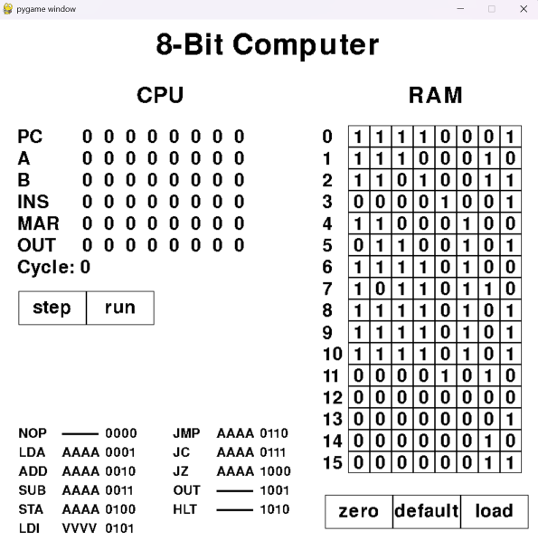

# GRCI
## Description
Compiler for an educational hardware description language.  I use this to teach computer architecture.

## Getting Started
This library contains two files, grci.c and grci.h, in the src/ directory.  Should compile with any C compiler
that implements at least C99.

## Basic Usage

    #include "grci.h"
    #include <stdio.h>
    #include <string.h>
    #include <stdlib.h>

    int main(int argc, char **argv) {
        //initializing grci library with given memory allocators
        struct grci *g = grci_init(malloc, realloc, free);

        //Making two modules in hdl, 'Not' and 'And'.  'Nand' modules are built-in.
        const char *src = "module Not(in) -> out { Nand(in, in) -> out } "
                          "module And(a, b) -> out { Nand(a, b) -> temp Not(temp) -> out }";

        //compiling source hdl. 
        grci_compile_src(g, src, strlen(src));

        //instantiating a module to simulate
        struct grci_module *m = grci_init_module(g, "And", strlen("And"));

        //setting inputs, step to update module state, and then reading the outputs
        m->inputs[0] = 0;
        m->inputs[1] = 1;
        grci_step_module(m);
        printf("expecting 0: %d\n", m->outputs[0]);

        //freeing module memory
        grci_destroy_module(m);

        //freeing grci library memory
        grci_cleanup(g);

        return 0;
    }

See examples/ for more code examples, including using the built-in DFF and Ram64K modules.

## Example Project
A student-built a GUI on top of a simulated 8-bit computer we built in class using the grci HDL.

## Improvements
Some functions are overly long and confusing, and could use a refactor
Rather than a fixed size for module element and wires arrays, they could be dynamically allocated for more flexibility
Testing could be more comprehensive, and organized into features tested, and tests renamed to describe what they actually test

## License
See LICENSE.md file for details

